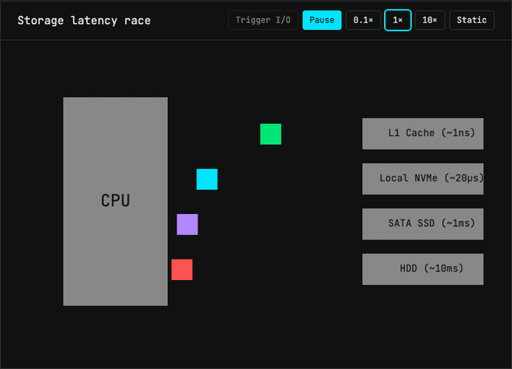
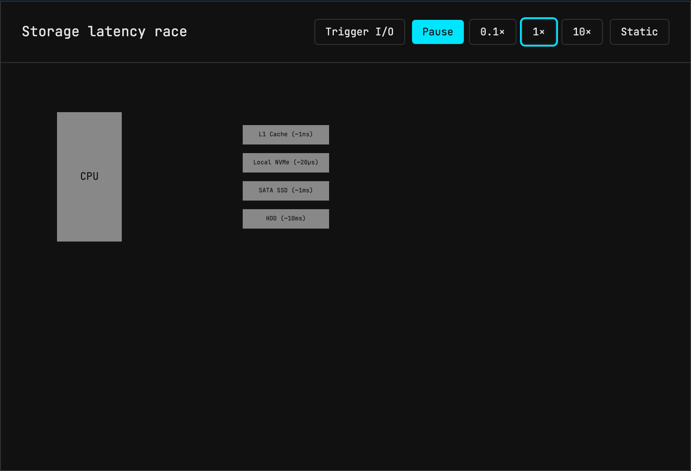
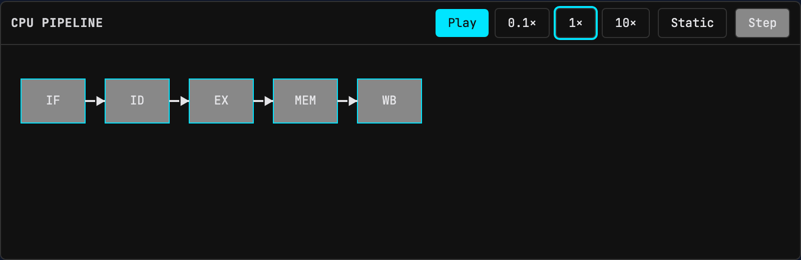

<div align="center">

# VisLab Widgets

_"Complexity is the enemy of understanding."_

**Embeddable systems & CS education simulations** for technical blogs and course sites — CPU pipelines, caches, schedulers, storage latency, and more.

[](LICENSE)
[](https://turbo.build/)
[](TODOS.md)

**Demo / docs (after deploy):** [GitHub Pages](https://mohitmishra786.github.io/vislab) · **Source:** this monorepo

</div>

<p align="center">
  
</p>
<p align="center">
  
</p>
<p align="center">
  
</p>

---

## Why VisLab Widgets?

Technical writing often sits between **static diagrams** that miss temporal behavior and **video embeds** that are heavy and hard to scrub.

VisLab ships **living canvas simulations** (Canvas 2D — not WebGL) with a shared `SimClock` (pause, 0.1×–10×), embeddable via React/MDX, static HTML, or Jekyll.

Aesthetic: flat geometry, monospace (JetBrains Mono), no gradients — inspired by interactive systems explainers (e.g. PlanetScale’s latency essays), productized as a reusable widget registry.

> **Name note:** Unrelated to university “VisLab” labs. Prefer **VisLab Widgets** in titles.

## Status (read this)

| Item | State |
| ---- | ----- |
| npm `@vislab/*` | **Not published yet** — use monorepo install |
| GitHub Releases | Pending first `0.1.0` |
| Bundle gzip | VisLab ≈ **22 KB** · Embeds ≈ **28 KB** (CI budgeted; per-widget ESM graphs ≤36 KB) |
| Support | **Tier 1:** React + static HTML · **Tier 2:** Jekyll · **Tier 3:** Puppeteer exporter |

## Packages

| Package | Version | Description |
| :------ | :------ | :---------- |
| **@vislab/core** | `0.0.0` | Canvas ECS, `SimClock`, primitives, themes (zero runtime deps) |
| **@vislab/components** | `0.0.0` | 17 simulation widgets (IIFE `VisLab`) |
| **@vislab/registry** | `0.0.0` | Single manifest + props schema + `create` |
| **@vislab/react** | `0.0.0` | React / MDX via `VislabMount` + named exports |
| **@vislab/web-components** | `0.0.0` | Custom elements, `[data-vislab]`, IIFE `VisLabEmbeds` |
| **@vislab/cli** | `0.2.0` | `vislab build`, `widget`, `preview`, `new` |
| **@vislab/exporter** | `0.0.0` | Optional Puppeteer frame capture (not needed for embeds) |
| **vislab-jekyll** | `0.1.0` | Jekyll layout + includes (**not on RubyGems yet** — path gem locally) |

## Quick start (monorepo)

```bash
git clone https://github.com/mohitmishra786/vislab.git
cd vislab
# Node >= 22.12 required
pnpm install
pnpm run build
pnpm run test
```

### React / Astro (workspace)

```tsx
import { CpuPipeline, StorageComparison } from "@vislab/react";

export function Demo() {
  return (
    <>
      <StorageComparison />
      <CpuPipeline stages={["IF", "ID", "EX", "MEM", "WB"]} />
    </>
  );
}
```

Astro: `<StorageComparison client:visible />`.

### Static HTML

```bash
pnpm --filter @vislab/cli exec vislab build -o ./public/vislab
```

```html
<script src="./vislab/vislab-embed.min.js" defer></script>
<div data-vislab="CacheSimulator" style="min-height:400px"></div>
```

### Studio (Copy MDX)

```bash
pnpm --filter studio dev
```

Full paths: [docs/QUICKSTART.md](docs/QUICKSTART.md).

## Flagship widgets

1. **Storage latency race** — relative L1 / NVMe / SSD / HDD motion  
2. **CPU pipeline** — stages + simplified hazards + SimClock  
3. **Cache hierarchy** — L1/L2/L3, LRU vs FIFO  
4. **Process scheduler** — RR / simplified CFS  
5. **Sort race** — algorithm race visual  

Plus 12 more in the registry (compiler, VM, graphs, …).

## Architecture

- **Core:** HTML5 Canvas 2D ECS, deterministic `SimClock`, zero runtime deps on `@vislab/core`
- **Registry-first:** one manifest drives React, custom elements, CLI, Studio
- **Monorepo:** pnpm + Turborepo; Biome lint; vitest; Playwright visual regression

## Accessibility & SEO

Canvas content is visual-only. Widgets expose chrome titles, button labels, `role="img"`, and a hidden text summary. **Authors must add figcaptions/prose** for screen readers and SEO. See docs on accessibility and SEO for embeds.

## Compare

| Tool | Use when |
| ---- | -------- |
| Mermaid | Diagrams as code |
| Excalidraw | Freeform sketch |
| **VisLab Widgets** | Systems **temporal** sims in your site |
| Video | Narrative film — heavier |

## Contributing

See [CONTRIBUTING.md](CONTRIBUTING.md). Roadmap: [TODOS.md](TODOS.md). Security: [SECURITY.md](SECURITY.md). Conduct: [CODE_OF_CONDUCT.md](CODE_OF_CONDUCT.md).

Audit implementation progress: [audits/IMPLEMENTATION_LOG.md](audits/IMPLEMENTATION_LOG.md).

## License

MIT
